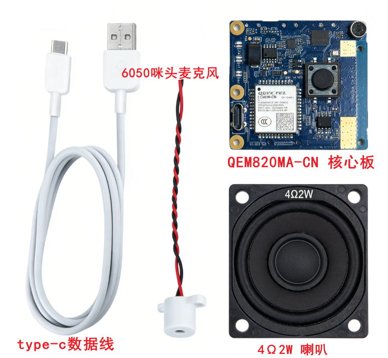
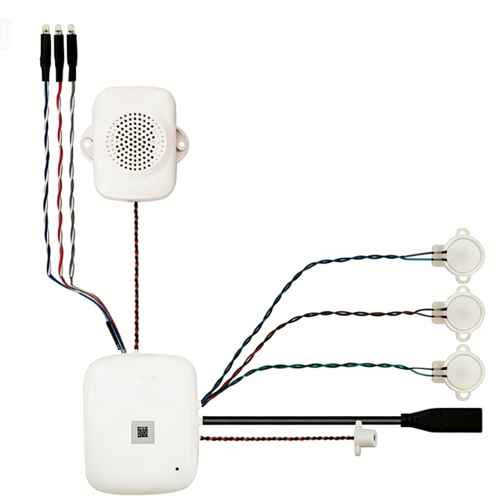
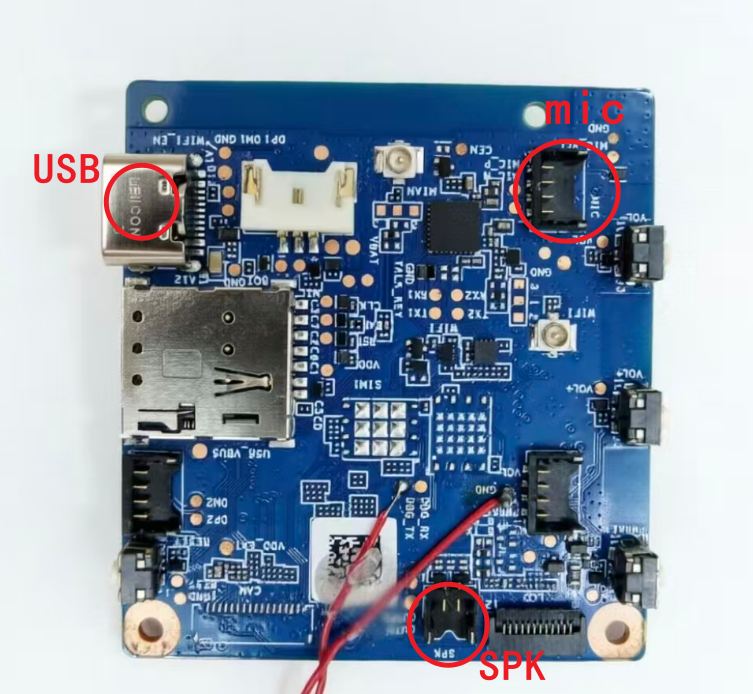
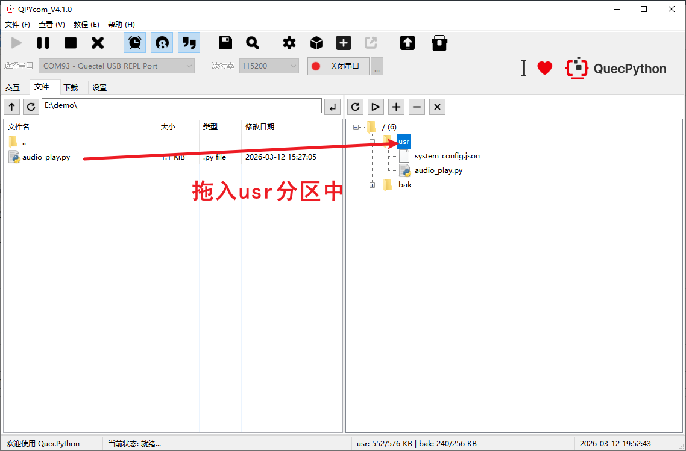
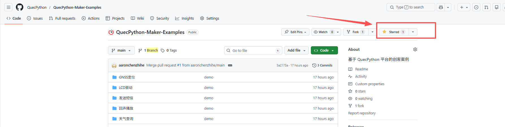

# 【QEM820MA-CN】回声检测：让开发板“听见”并“复述”你说的话

这是一个QuecPython使用录音和音频播放的简单示例，您将使用QEM820MA-CN开发板、喇叭、麦克风实现模组读取麦克风采集的原始音频，并通过外接的喇叭在本地进行播放，通过该项目您将进一步了解QuecPython音频模块的相关使用方法，并以此为基础拓展更多有趣玩法。


## 项目描述

本项目使用 **QEM820MA-CN** 开发板，配合 QuecPython 的音频功能，完成编写了一个简易的“录音笔 + 喇叭”。
用户对着麦克风说话，开发板将音频录下来，然后立马通过外接喇叭放出来。

## 项目介绍

- 学习怎么用最顺手的 QPYcom 工具烧录固件、跑代码。
- 学习怎么调用QuecPython的 Record 接口，让板子把麦克风的声音存下来。
- 学习怎么调用 QuecPython的Audio 接口，把存好的声音从喇叭里轰出来。


#### 硬件清单：

部分配件可在[移远官网商城](https://www.quecmall.com/)或[移远天猫旗舰店](https://yiyuanznsb.tmall.com/)查询购买

- QEM820MA-CN 开发套件
- 麦克风（连接开发板的 mic 口）
- 喇叭（连接开发板的 spk 口）
- USB 线（连接电脑）

​	

QEM820MA-CN开发套件示意图

​	

#### 软件清单：

(可前往 [QuecPython下载专区](https://www.quectel.com.cn/quecpython/developer-resources) 搜索)

| 名称           | 类型 | 描述                                                   |
| -------------- | ---- | ------------------------------------------------------ |
| QuecPython驱动 | 驱动 | 必需，用于识别交互端口，根据模组型号在下载专区进行下载 |
| QuecPython固件 | 固件 | 必需，根据模组型号在下载专区进行下载                   |
| QPYcom         | 工具 | 必需，用于烧录固件和代码，可在下载专区下载             |

 **注意事项：**

- **驱动别下错：** 比如你是 EC800M 模组，就下对应的 `QuecPython_USB_Driver_Win10_ASR`。下错了端口识别不到，别怪板子不灵。
- **固件要对号入座：** 固件文件名尾缀必须和你的模组完全一致。例如EC800MCNLE就要下载EC800M系列里尾缀为CNLA的固件包。
- **路径别带中文：** 解压固件包时，文件夹路径里千万别有中文，不然容易报错。


### 硬件连接

**连线：** 麦克风插 mic，喇叭插 spk，USB 连电脑。

​	


### 软件烧录

**烧录：**打开 QPYcom，选对端口（REAL PORT），按提示把固件刷进去。

​	

**运行：** 把示例脚本拖进 usr 分区，右键点击运行。

​	

**结果：**查看QPYcom的log，打印 record start时用户说话，打印 record end停止说话，开发板自动播放录音

烧录固件和代码详细流程：[点此跳转](https://developer.quectel.com/doc/quecpython/Getting_started/zh/)


### 代码讲解

根据回调函数返回的参数值判断是否结束即可，未结束将音频直接存入临时缓冲区，结束进行播放。代码使用到的接口[点此参考](https://developer.quectel.com/doc/quecpython/API_reference/zh/medialib/audio.Record.html)

```python
def stream_rec_cb(para):
    global buf
    if(para[0] == 'stream'):
        if(para[2] == 1):
            read_buf = bytearray(para[1])
            rec.stream_read(read_buf,para[1])
            buf += read_buf
            del read_buf
        elif (para[2] == 3):
            pass
            aud.stopPlayStream()
            aud.playStream(aud_type, buf)
```


### 常见问题：为啥没声音？

**Q：** 代码逻辑明明没错，也是先录音后播放，但喇叭就是哑巴？
**A：** 99% 是因为 **PA 引脚没拉高**！
音频模块工作前，必须先把 PA 引脚电平拉高才能驱动喇叭。

- **解决方法：** 代码里加上 `Pin` 模块的操作，或者直接用更简单的 Audio.set_pa() 方法搞定。


觉得这个项目对您有所帮助？别忘了在仓库点个 **Star** ⭐️ 支持我们，您的收藏是我们的动力！

