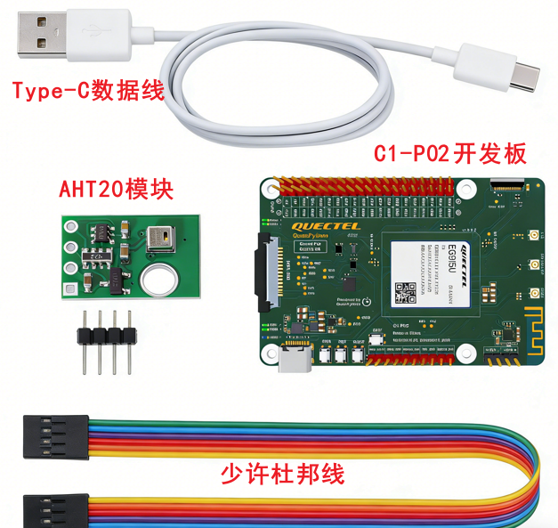
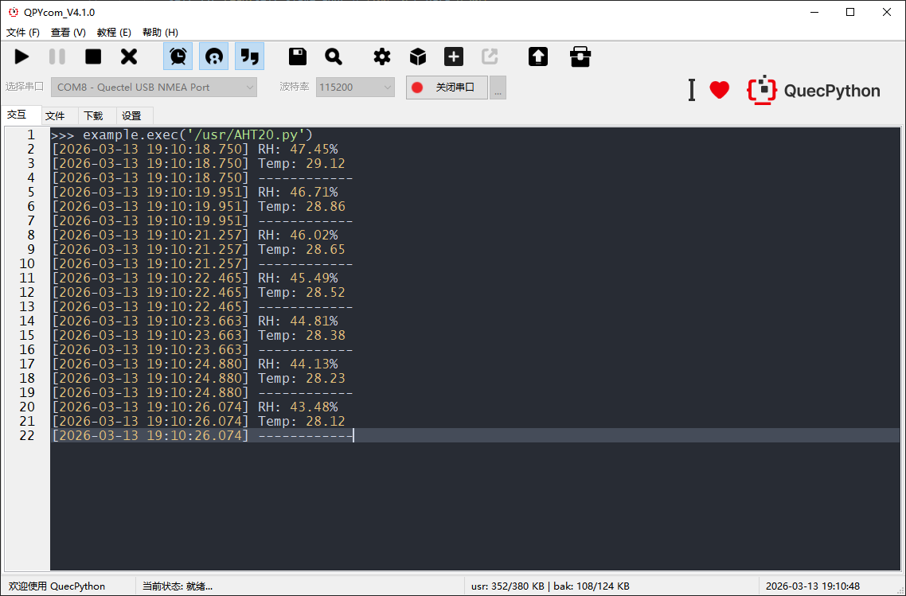
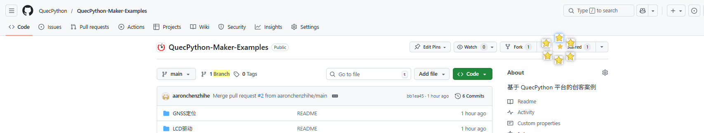

# 赋予机器“感知”：AHT20 温湿度传感器极速上手

本案例基于C1-P02开发板和ATH20模块实现了环境温湿度数据的采集，不讲解复杂深奥的I2C协议，带你使用QuecPython提供的接口快速为自己的开发板添加“感知”功能。

### **清点你的“感官”装备**

在开始之前，请确保你的工作台上有下列物品。**注意：细节决定成败，很多“故障”其实源于装备不匹配。**

#### 核心硬件

- C1-P02 开发板，[点此购买](https://www.quecmall.com/goods-detail/2c90800b94028e0c01944e04265a0065)
- AHT20 温湿度传感器模块，[点此购买](https://detail.tmall.com/item.htm?ali_refid=a3_430673_1006%3A1109983619%3AH%3Ao1o9pcCHA0EaS2OCFaFJPSDYxEgRhB0t%3Aca0e7dfbc8d45bae409ed82ce337d4b1&ali_trackid=318_ca0e7dfbc8d45bae409ed82ce337d4b1&id=730999612097&loginBonus=1&mi_id=0000TxvmLkUmU1pVjve0PJuSaQ9oRMJXoG8QLc73bmsL1Wo&mm_sceneid=0_0_98938874_0&priceTId=214784a217742517688952842e3bca&spm=a21n57.sem.item.4&utparam=%7B%22aplus_abtest%22%3A%22b82798c3a2098d292e456959ee67f8a9%22%7D&xxc=ad_ztc)
- 一根USB数据线和少许杜邦线 

​	

#### **软件军火库**

所有软件请在[QuecPython下载专区](https://www.quectel.com.cn/quecpython/developer-resources)获取，**严禁混用型号**。

| **名称**            | **作用**                 | **注意事项**                                                 |
| ------------------- | ------------------------ | ------------------------------------------------------------ |
| **QuecPython 驱动** | 建立电脑与板子的通信桥梁 | 型号必须严格匹配                                             |
| **QuecPython 固件** | 开发板运行代码的环境     | 尾缀必须一致。例如模组型号含 `CNLE`，固件也必须选 `...CNLE` 版本。 |
| **QPYcom 工具**     | 代码烧录与调试终端       | 官方烧录工具，无需额外配置。                                 |

**中文路径陷阱**：解压固件和代码的文件夹路径中，绝对不能包含任何中文字符或空格！
❌ 错误示范：D:\我的下载\新建文件夹\firmware
✅ 正确示范：D:\dev\firmware

### 神经连接 (硬件接线)

| AHT20 模块引脚 | 颜色建议 | C1-P02 开发板引脚 | 功能说明        |
| -------------- | -------- | ----------------- | --------------- |
| **VCC**        | 红色     | **3V3**           | 电源正极 (3.3V) |
| **GND**        | 黑色     | **GND**           | 电源接地        |
| **SCL**        | 蓝色     | **SCL1**          | 时钟信号线      |
| **SDA**        | 黄色     | **SDA1**          | 数据信号线      |

### 注入灵魂 (软件部署)

- 烧录系统固件

  - 启动 **QPYcom** 工具。
  - 在端口列表中选择正确的 COM 口（通常标识为 REAL PORT ）。
  - 点击下载窗口，进入烧录固件和代码界面。
  - 加载已下载好的、与模组型号完全匹配的固件文件。
  - 点击“烧录”按钮。稍候片刻，待进度条走完并提示“成功”，系统便已就绪。

  详细固件烧录教程可[点此查看](https://developer.quectel.com/doc/quecpython/Getting_started/zh/4G/flash_firmware.html)

- **运行感知代码**

  - 在 QPYcom 左侧文件栏，找到示例代码文件 (aht20_demo.py)。
  - (可选) 如果你想修改数据刷新频率，可以用vscode打开代码，调整 sleep_ms() 中的数值。
  - 将代码文件拖拽至开发板的 usr 目录中。
  - **右键点击** 该文件，选择 "**Run**" (运行)。

  详细脚本烧录教程[点此查看](https://developer.quectel.com/doc/quecpython/Getting_started/zh/4G/first_python.html#PC%E4%B8%8E%E6%A8%A1%E7%BB%84%E9%97%B4%E7%9A%84%E6%96%87%E4%BB%B6%E4%BC%A0%E8%BE%93)


### **见证奇迹 (互动验证)**

此刻，请将目光锁定在 QPYcom 的**日志输出。**

**正常现象**：你会看到类似以下的数据流不断滚动刷新：

​	

**互动测试**：

1. 哈气测试：对着 AHT20 传感器轻轻哈一口气。预期结果：湿度数值 (RH) 应该会迅速飙升，随后缓慢回落。
2. 体温测试：用手指紧紧捏住传感器头部约 10 秒。预期结果：温度数值 (Temp) 应该会逐渐上升，接近你的体温。

如果数据在跳动，恭喜你！ 你已经成功让机器拥有了感知。这不仅仅是几个数字，这是物联网项目中最基础的“感知”能力。


### 代码详解

核心代码只有两行，调用两个接口`machine.I2C.read`和`machine.I2C.write`，发送数据和接收数据内容查询AHT20的数据手册即可。QuecPython的I2C接口指导文档[点此查看](https://developer.quectel.com/doc/quecpython/API_reference/zh/peripherals/machine.I2C.html)

例如初始化AHT20模块和读取数据

```python
self.slave_addr = 0x38   # AHT20 slave address
self.INIT_CMD = b'\xE1'  # initialize command

def init(self):
    self.i2c.write(self.slave_addr,b'\x00',0,self.INIT_CMD,len(self.INIT_CMD))
    
def read(self):
    # Send measurement cmd to trigger data acquirement.
    self.i2c.write(self.slave_addr,b'\x00',0,self.MEASURE_CMD,len(self.MEASURE_CMD))

    #wait for data ready (at least 80ms)
    sleep_ms(80)
    r_data = bytearray([0x00]*6)
    self.i2c.read(self.slave_addr,b'\x00',0,r_data,6,80)    
```


喜欢这篇指南？觉得 AHT20 很有趣？别忘了给仓库点个 **Star** ⭐️，你的支持是我们更新更多好玩教程的动力！

