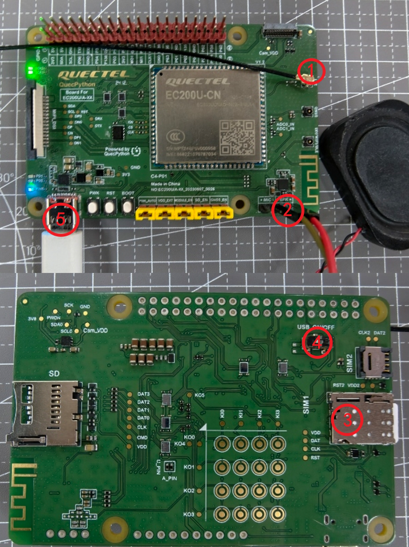
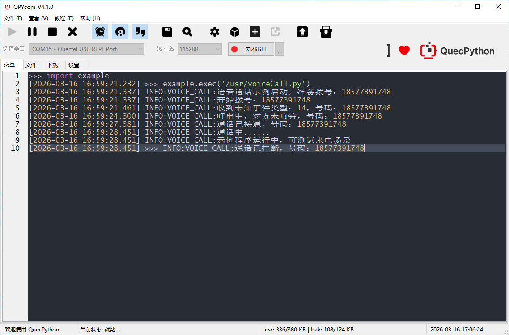
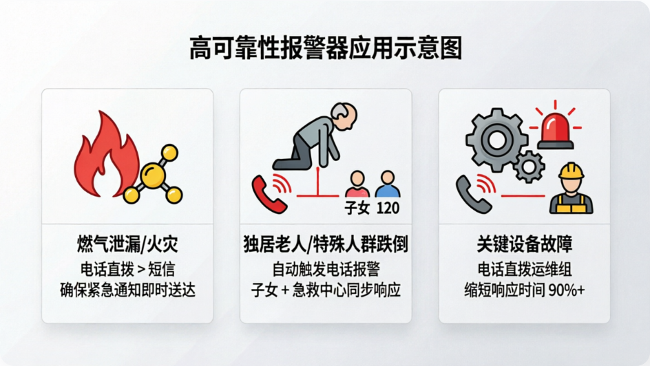

# 【C4-P01开发板】让开发板“打电话”：从入门到掌控物联网语音交互

本案例基于C4-P01开发板简单实现了一个与手机终端拨打和接听电话的教程。无需进行任何复杂操作，几行代码轻松实现。


### 明确目标

当前案例的任务非常明确：让你的**开发板主动拨打和接听你的电话**。

我们使用的是一套成熟且强大的方案——**C4-P01 开发板搭配 EC200U 通信模组**。别看它体积小，这可是能直接商用、稳定可靠的通信核心。当它成功呼叫你时，你就已经掌握了智能家居报警、独居老人守护、设备故障紧急通知等物联网场景的底层技术。


### 开发资源

#### 硬件资源

- 一块QuecPython C4-P01 开发板，[点此购买](https://www.quecmall.com/goods-detail/2c90800c94028da2019444a30d8d006b)
- 一张能打电话的SIM卡
- 一根LTE天线，[点此购买](https://www.quecmall.com/goods-detail/2c90800b9488359c0195f48a855603d3)
- 一根USB数据线（USB-A to USB-C）
- 一个4Ω2W规格的喇叭，[点此购买](https://www.quecmall.com/goods-detail/2c90800c9488358b01956aa656680239)

#### 软件资源

- **QuecPython 驱动**：连接电脑与开发板的桥梁。去官网下载适配模组型号的最新版本。EC200U适配驱动[点此下载](https://developer.quectel.com/wp-content/uploads/2024/09/Quectel_Windows_USB_DriverU_V1.0.19.zip)
- **QuecPython 固件**：EC200U固件[点此跳转下载](https://www.quectel.com.cn/download-zone)。**匹配原则**：如果模组型号后缀带有 CNLE，固件也必须选择CNLE版本，保持“门当户对”才能稳定运行。
- **QPYcom 工具**：官方出品的一站式工具，烧录固件、编写代码、查看日志全搞定，无需复杂配置，开箱即用。[点此下载](https://developer.quectel.com/wp-content/uploads/2024/09/QPYcom_V4.1.0.zip)


### 操作教程

#### 第一步：硬件连接

​	

1. 将 LTE 天线牢固地按紧在开发板的LTE底座上。
2. 小喇叭接在开发板spk口上。
3. 将 SIM 卡芯片朝下插入卡槽，听到清脆的“咔哒”声即表示安装到位。
4. 将USB开关拨至on标识一侧
5. 使用数据线将开发板连接至电脑 USB 端口。

#### 第二步：固件烧录(已烧录可跳过)

1. 启动 **QPYcom** 工具。
2. 在端口列表中选择正确的 COM 口（通常标识为 REAL PORT ）。
3. 点击下载窗口，进入烧录固件和代码界面。
4. 加载已下载好的、与模组型号完全匹配的固件文件。
5. 点击“烧录”按钮。稍候片刻，待进度条走完并提示“成功”，系统便已就绪。

详细固件烧录教程可[点此查看](https://developer.quectel.com/doc/quecpython/Getting_started/zh/4G/flash_firmware.html)

#### 第三步：代码部署与运行

1. **修改目标号码**：打开示例代码，找到 TARGET_PHONE 变量，将其值修改为你自己的手机号码。
2. **上传脚本**：在 QPYcom 的文件管理区，将修改好的脚本拖入开发板的 usr 目录。
3. **执行代码**：右键点击该脚本文件，选择“运行”。

详细脚本烧录教程[点此查看](https://developer.quectel.com/doc/quecpython/Getting_started/zh/4G/first_python.html#PC%E4%B8%8E%E6%A8%A1%E7%BB%84%E9%97%B4%E7%9A%84%E6%96%87%E4%BB%B6%E4%BC%A0%E8%BE%93)

#### 第四步：见证时刻

- **观察日志**：QPYcom 下方的日志窗口若打印出Call Start或类似的成功标识，说明指令已下发。
- **接听电话**：几秒内，你的手机应该会响起，来电显示即为开发板中 SIM 卡的号码。
- **交互测试**：你可以尝试接通电话，听是否有音频输出，或挂断后观察日志中的状态反馈，验证整个流程的闭环。

​	


### 代码详解

脚本中使用的主要类为`voiceCall`, 详情[参考](https://developer.quectel.com/doc/quecpython/API_reference/zh/iotlib/voiceCall.html)。

`dial_call`为电话呼叫方法，核心调用`voiceCall.callStart`接口进行外呼，方法内其余代码主要为通话状态判断和超时挂断机制。

```python
def dial_call(self, phone_num):
    """发起语音呼叫"""
    if self.call_status != 0:
        vc_log.error("当前有活跃通话，无法拨号")
        return False

    self.call_status = 1  # 更新为拨号中
    vc_log.info("开始拨号：{}".format(phone_num))
    ret = voiceCall.callStart(phone_num)
    if ret != 0:
        vc_log.error("拨号失败，错误码：{}".format(ret))
        return False

    # 等待通话接通或超时
    start_time = utime.time()
    while self.call_status != 2:  # 未接通
        if utime.time() - start_time > CALL_TIMEOUT:
            vc_log.warning("拨号超时（{}秒），自动挂断".format(CALL_TIMEOUT))
            self.hangup_call()
            return False
        if self.call_status == 0:  # 对方已挂断
            vc_log.info("对方已挂断")
            return False
        utime.sleep(1)

    return True
```

`answer_call`为接听电话方法，核心调用`voiceCall.callAnswer`接口实现来电接听

```python
def answer_call(self):
    """接听来电"""
    if self.call_status != 3:  # 非来电状态
        vc_log.error("当前无来电，无法接听")
        return False

    vc_log.info("接听来电：{}".format(self.incoming_num))
    ret = voiceCall.callAnswer()
    if ret == 0:
        self.call_status = 2  # 更新为通话中
        return True
    else:
        vc_log.error("接听失败，错误码：{}".format(ret))
        return False
```

 `__call_state_callback`为通话状态回调函数，主要作用是更新通话状态，根据状态调用对应的处理函数


### 遇到问题？这里是解决方案

即使是最专业的开发者也会遇到小插曲，以下是常见问题的快速排查指南：

#### 问题一：日志报错或手机无反应

**检查天线**：确认 LTE 天线是否拧紧在正确的接口上，信号质量直接影响通话建立。
**验证 SIM 卡**：将 SIM 卡插入普通手机，测试是否能正常拨打电话，排除欠费或功能限制（如被拦截）的可能。
**核对号码**：仔细检查代码中的手机号格式，确保无多余空格或数字错误。

#### 问题二：QPYcom 无法识别端口

**重装驱动**：以管理员身份重新安装对应型号的 USB 驱动。
**更换线材/接口**：尝试更换 USB 端口或换一根确认为数据传输线的线缆。


### 从实验到产品：无限可能

恭喜你，完成了这个看似简单却极具价值的实验。你不仅仅让开发板打了个电话，更是掌握了**“基于蜂窝网络的紧急语音通知”**这一核心能力。

这项技术可以直接转化为解决实际问题的方案：

- 高可靠性报警器：相比短信，电话通知在紧急情况下（如燃气泄漏、火灾）更能确保用户及时获知。
- 智能看护系统：为独居老人或特殊人群设计跌倒检测，一旦触发自动拨打子女或急救中心电话。
- 工业设备监控：关键设备故障时，直接拨打运维人员电话，缩短响应时间。

​	

这只是开始。移远通信拥有庞大的开源社区和丰富的案例库，更多进阶玩法等你来探索。

如果你觉得这个项目有价值，欢迎给仓库点个 Star，与更多开发者一起交流，将创意变为现实。

物联网的世界很大，但入门可以很简单。保持好奇，随时连接。

