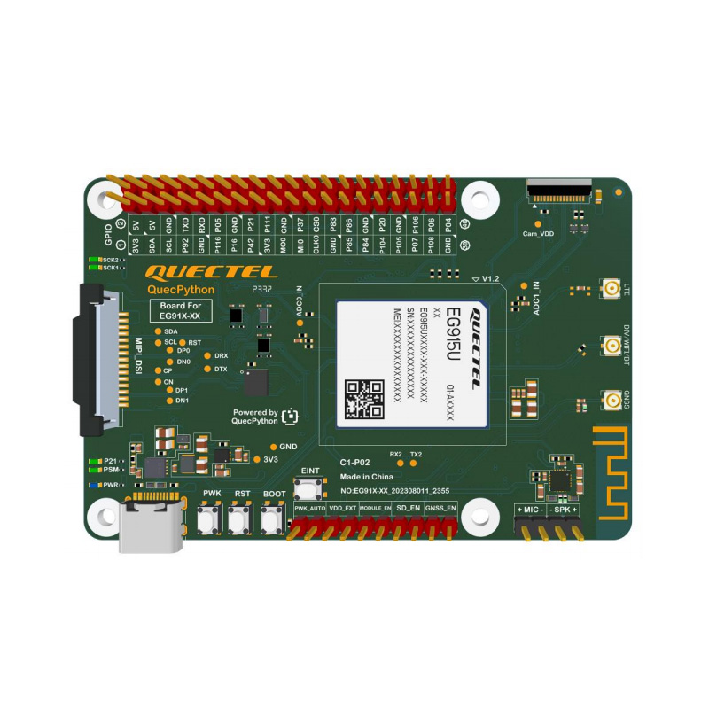
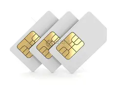
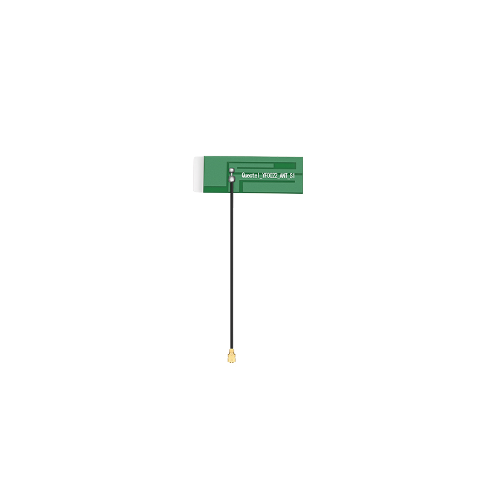
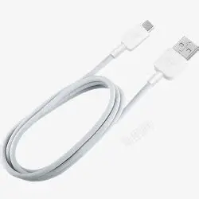
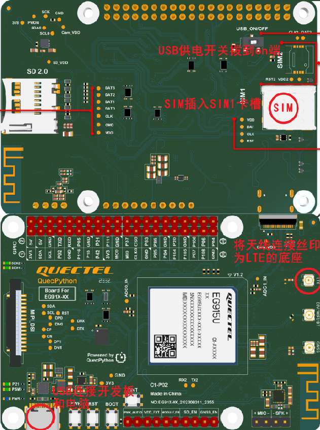
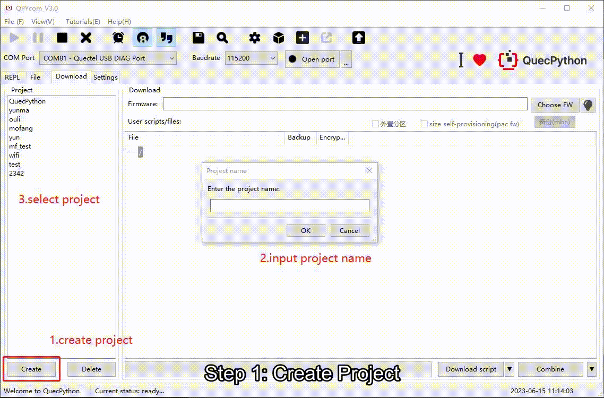
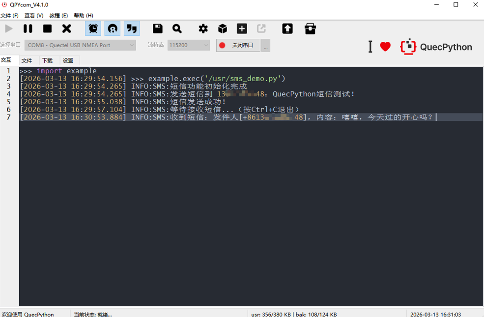
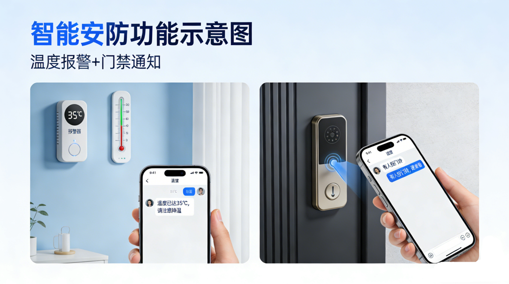

# 蜂窝通信初应用：SMS通信

本案例使用C1-P02开发板实现的与手机终端的双向短信通信，无需复杂的电路搭建，不用懂深奥的协议。只要你有 SIM 卡和开发板，跟着步骤走，一杯咖啡的时间就能搞定双向短信测试。


## 项目目的

别被“物联网通信”这种大词吓到。本案例只需实现两个功能：

1. **发**：让手里的 **C1-P02 开发板**给你的手机发一条短信。
2. **收**：你给开发板回一条短信，看它能不能在电脑屏幕上“复述”出来。

**核心技能**：学会调用QuecPython的 SMS 模块，这是一些远程通知类项目（比如温度报警、门磁提醒）的基础。


## 项目介绍

### 硬件清单

工欲善其事，必先利其器。部分硬件可在[移远官方商城](https://www.quecmall.com/)购买，开工前请核对以下清单：

| **类别** | **名称**                    | **⚠️ 关键检查点 (必看!)**                                     | **实物图**                                                   | 购买方式                                                     |
| -------- | --------------------------- | ------------------------------------------------------------ | ------------------------------------------------------------ | ------------------------------------------------------------ |
| 核心板   | C1-P02 开发板               | 确认开发板搭载的具体模组型号。                               |  | [点此购买](https://www.quecmall.com/goods-detail/2c90800b94028e0c01944e04265a0065) |
| 通信卡   | SIM 卡                      | 必须能发短信 (有些物联卡只能上网)                            |  | 自行准备                                                     |
| 配件     | LTE天线 (4GFPC天线YF0022AA) | 必须拧在标有 `LTE` 的接口上，拧反了或没拧紧可能出现没信号的情况。 |   | [点此购买](https://www.quecmall.com/goods-detail/2c90800b9488359c0195f48a855603d3) |
| 连接线   | USB 数据线(一端Type-C)      | 确保是数据线，不是只能充电的线。                             |   | 自行准备                                                     |

### 软件清单

所有软件请在[QuecPython官方下载专区](https://www.quectel.com.cn/quecpython/developer-resources)获取，**严禁混用型号**。

| **名称**            | **作用**                 | **注意事项**                                                 |
| ------------------- | ------------------------ | ------------------------------------------------------------ |
| **QuecPython 驱动** | 建立电脑与板子的通信桥梁 | **型号必须严格匹配开发板搭载的模组型号**。                   |
| **QuecPython 固件** | 开发板运行代码的环境     | 尾缀必须一致。例如模组型号含 `CNLE`，固件也必须选 `...CNLE` 版本。 |
| **QPYcom 工具**     | 代码烧录与调试终端       | 官方集成开发环境，无需额外配置。                             |

> 注意事项：解压固件和代码的文件夹路径中，绝对不能包含任何中文字符或空格！
>
> 错误示范：D:\我的下载\新建文件夹\firmware
> 正确示范：D:\dev\firmware


### 硬件连接

1. 将 SIM 卡芯片朝下插入卡槽，听到“咔哒”声表示到位。
2. 将 LTE 天线按紧在开发板的 `LTE` 接口。
3. 通过 USB 线将开发板连接至电脑。

​	

### 软件烧录 (如果已烧录可跳过)

1. 打开 **QPYcom** 工具。
2. 选择正确的 COM 端口 (通常显示为 REAL PORT或NAME PORT)。
3. 选择 **模组型号对应版本** 的固件文件，点击“烧录”。
4. 等待进度条走完，弹出“Download Success”窗口即可。

​	

软件烧录的详细步骤[点此跳转](https://developer.quectel.com/doc/quecpython/Getting_started/zh/)

### **代码运行与观察**：

​	


## 代码讲解

代码结构并不复杂，主要分为接收和发送接口

### 发送短信

`send_sms`为封装好的发送短信接口，使用QuecPython的`sms.sendTextMsg`接口，接口[详情参考](https://developer.quectel.com/doc/quecpython/API_reference/zh/iotlib/sms.html#%3Ccode%3Esms.sendTextMsg%3C/code%3E)。

```python
def send_sms(phone, msg):
    """发送短信（中文默认UCS2编码）"""
    sms_log.info("发送短信到 {}：{}".format(phone, msg))
    ret = sms.sendTextMsg(phone, msg, "UCS2")
    if ret == 0:
        sms_log.info("短信发送成功！")
    else:
        sms_log.info("发送失败，错误码：{}".format(ret))
```

### 接收短信

接收短信使用回调触发方式，收到新短信时回调函数触发，在回调函数里我们使用 `sms.searchTextMsg` 读取短信内容，接口[详情参考](https://developer.quectel.com/doc/quecpython/API_reference/zh/iotlib/sms.html#%3Ccode%3Esms.searchTextMsg%3C/code%3E)。

```python
# 初始化：注册接收短信回调
def sms_receive_callback(args):
    """收到新短信自动触发"""
    sim_id, sms_index, _ = args
    # 读取短信内容
    content = sms.searchTextMsg(sms_index)
    if content != -1:
        sender, msg, _ = content
        sms_log.info("收到短信：发件人[{}]，内容：{}".format(sender, msg))

# 注册接收回调
sms.setCallback(sms_receive_callback)
```


## 常见问题

**现象 A：日志报错，或者手机死活收不到短信**

- 急救方案：
  1. 摸一下天线，是不是松了？是不是拧错接口了？
  2. 把 SIM 卡拔出来插手机里，确认能正常收发短信，且没欠费。
  3. 检查代码里的手机号有没有多写空格或少写数字。

**现象 B：QPYcom 找不到端口，或者显示灰色**

- 急救方案：
  1. 驱动可能下错了或者没装好！重新下载安装模组的专用驱动**，安装时记得**右键-以管理员身份运行。
  2. 换个 USB 口，或者换根数据线试试（有些线只能充电）。


## 拓展参考

搞定短信收发，你就解锁了“远程通知”技能树！ 接下来可以试试：

- **温度报警器**：温度超过 30 度，自动发短信给你。
- **门禁通知**：有人按门铃，发短信提醒你。

​	

*觉得对您有所帮助？别忘了给仓库点个 Star ⭐️*


